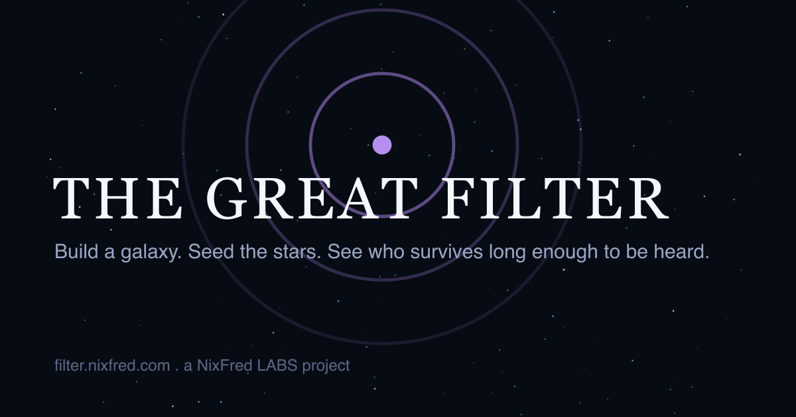
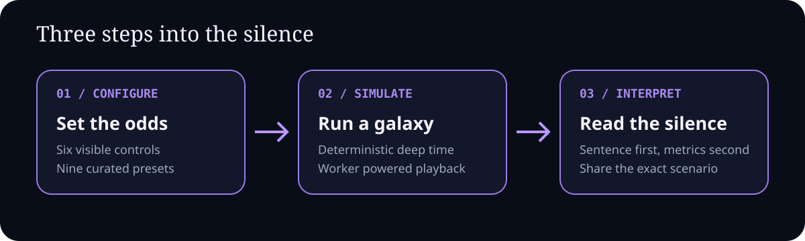
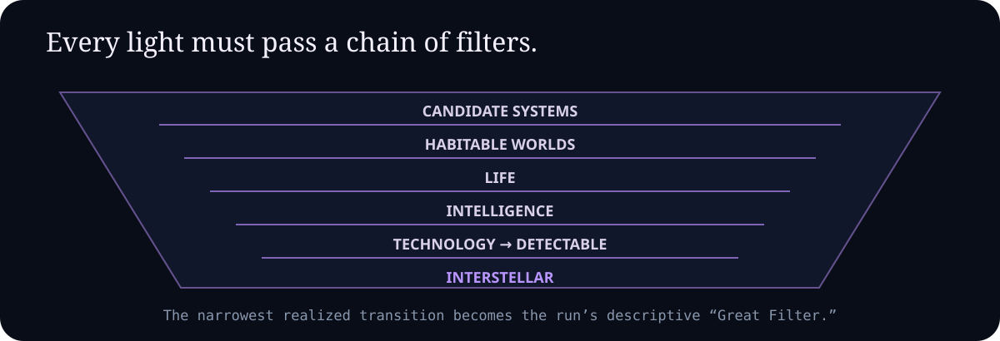
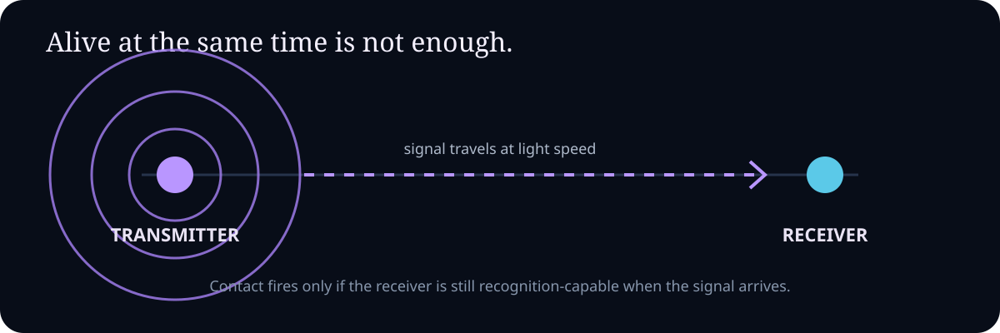
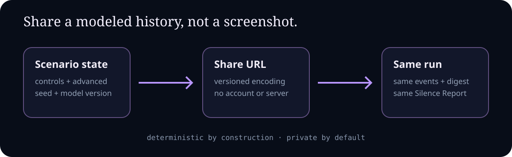

<div align="center">



# The Great Filter

### Build a galaxy. Seed the stars. See who survives long enough to be heard.

An interactive, scientifically honest Fermi paradox simulator running entire galactic histories across billions of modeled years.

[](https://react.dev)
[](https://www.typescriptlang.org)
[](https://threejs.org)
[](LICENSE)

**[Launch the simulation →](https://filter.nixfred.com)**

</div>

## What happens when the galaxy gets ten billion years?

Choose how readily life, intelligence, technology, survival, communication, and expansion emerge. Then watch a deterministic event-driven simulation unfold: civilizations appear as points of light, most disappear, some transmit, and a rare few spread.

The application models possibilities. It does not claim to solve the Fermi paradox or predict humanity's future.



Nine presets make the question tangible, from **The Silent Galaxy** and **Rare Earth** to **Expansion Wins**, **Optimist's Milky Way**, and a fifty-billion-year **Deep Time** scenario.

## Six controls, one conditional chain

The sliders are not six percentages applied independently to every star. Each governs a stage in a conditional transition and hazard model. A world must reach one stage before it can attempt the next; survival operates continuously once technology appears.



Civilizations can become quiet, go extinct, or transform after sustained interstellar settlement. The report identifies the most restrictive *realized* transition in that run without presenting it as a fact about the real universe.

## Contact respects physics

Two civilizations existing at the same abstract time is not contact. A detectable signal must cross the distance at light speed and arrive while another civilization is still capable of recognizing it. Expansion-front overlap is tracked separately and never inflated into confirmed contact.



Signals can arrive after their sender has vanished. Civilizations cannot cause one another's extinction: warfare is deliberately absent from the model.

## Every shared link is a reproducible galaxy

The seeded random generator, scenario schema, and simulation model are versioned. Controls, advanced parameters, seed, and model version travel in the URL, so a shared link recreates the same event history, metrics, and outcome sentence.



There are no accounts, cookies, payments, or server-side scenario records. Preferences remain in local storage; the scenario itself stays in the URL.

## The Silence Report

Every completed or stopped run produces a sentence-first outcome followed by fifteen transparent metrics in three groups:

- **Population funnel:** candidate worlds through detectable civilizations and disappearances
- **Overlap and contact:** simultaneous activity, signal overlap, travel overlap, and confirmed contact
- **Records:** nearest misses, lifetimes, and the run's most restrictive transition

Replay the same history, create a new galaxy, or share the exact scenario.

## Architecture

- React 19 and strict TypeScript on Vite
- Three.js galaxy renderer with non-WebGL and low-power fallbacks
- Event-driven simulation isolated in a Web Worker
- Versioned scenario serialization and deterministic seeded RNG
- Fixed-point simulated time across horizons up to fifty billion years
- Accessible keyboard operation, reduced-motion behavior, and nonvisual status updates
- Static Cloudflare Pages deployment; no application backend

The complete model is documented in [docs/simulation_model.md](docs/simulation_model.md), with assumptions categorized in [docs/scientific_assumptions.md](docs/scientific_assumptions.md) and architecture in [docs/ARCHITECTURE.md](docs/ARCHITECTURE.md).

## Run locally

Requires Node.js 26 or newer.

```bash
git clone https://github.com/nixfred/filter.git
cd filter
npm ci
npm run dev
```

## Quality gates

```bash
npm run check:all
```

The full gate runs formatting, linting, type checking, simulation tests, coverage, production build, bundle budgets, end-to-end tests, and accessibility checks. Individual commands are available through `package.json`.

## Project documentation

| Document | Purpose |
|---|---|
| [Product requirements](docs/PRD.md) | Stable requirement IDs and acceptance criteria |
| [Simulation model](docs/simulation_model.md) | State machine, hazards, time, contact, and expansion |
| [Scientific assumptions](docs/scientific_assumptions.md) | Established science vs. explicit modeling choices |
| [Architecture](docs/ARCHITECTURE.md) | Runtime boundaries and determinism strategy |
| [Accessibility](docs/ACCESSIBILITY.md) | Keyboard, motion, contrast, and nonvisual requirements |
| [Gate matrix](docs/GATES.md) | Requirement-to-evidence traceability |

## License

[MIT](LICENSE). Built by [Fred Nix](https://nixfred.com) with Larry.
